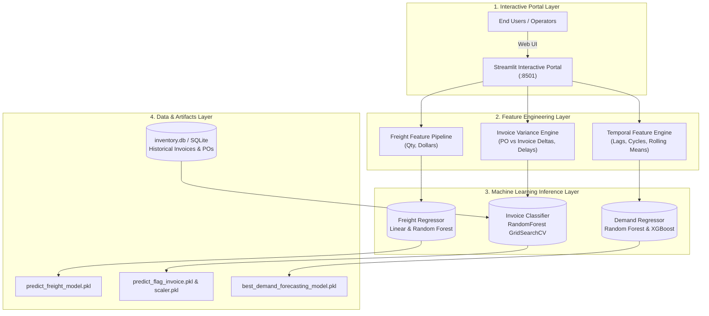

<div align="center">

# 📦 Supply Chain & Vendor Invoice Intelligence System

### *Enterprise Machine Learning Platform for Freight Estimation, Invoice Audit Risk Flagging, and Multi-Warehouse SKU Demand Forecasting*

[](https://mahatoaditya24-product-demand-forecasting-inferenceapp-mvyy16.streamlit.app/)
[](https://github.com/mahatoaditya24/Product-Demand-Forecasting/actions)
[](https://www.docker.com/)
[](https://www.python.org/)
[](https://opensource.org/licenses/MIT)

</div>

---

> 🚀 **Live Interactive Demo**: [https://mahatoaditya24-product-demand-forecasting-inferenceapp-mvyy16.streamlit.app/](https://mahatoaditya24-product-demand-forecasting-inferenceapp-mvyy16.streamlit.app/)
> 
> 📂 **GitHub Repository**: [https://github.com/mahatoaditya24/Product-Demand-Forecasting](https://github.com/mahatoaditya24/Product-Demand-Forecasting)

---

## 📖 Executive Summary

Supply chain efficiency in modern retail and e-commerce relies heavily on accurate logistics cost forecasting, automated vendor payment audits, and dynamic inventory replenishment. 

This platform implements an enterprise machine learning system addressing **three core operational bottlenecks**:
1. 🚛 **Freight Cost Prediction**: High-precision regression forecasting shipment logistics expenses from unit volumes and invoice valuations.
2. 🚨 **Vendor Invoice Risk Auditing**: Automated anomaly detection classification flagging discrepancies between vendor invoices and purchase orders (PO) to prevent financial overpayments.
3. 📊 **Product Demand Forecasting**: Multi-warehouse time-series tabular regression predicting future SKU-level order demand and calculating 95% service-level safety stock buffers.

---

## 🏗️ System Architecture



---

## 🚀 Machine Learning Modules

### 1. 🚛 Freight Cost Prediction
- **Objective**: Accurately forecast transportation and freight expenses.
- **Input Features**: `Quantity` (units shipped), `Dollars` (invoice value).
- **Models Benchmarked**: Linear Regression, Decision Tree Regressor, Random Forest Regressor.
- **Optimization Metric**: Lowest Mean Absolute Error ($\text{MAE}$).

### 2. 🚨 Invoice Risk & Manual Approval Flagging
- **Objective**: Prevent financial leakage by auditing vendor invoices against line-item purchase orders.
- **Rules & Synthetic Label**:
  - PO vs. Invoice discrepancy: $|\text{invoice\_dollars} - \text{total\_item\_dollars}| > \$5.00$.
  - Shipping delay: $\text{avg\_receiving\_delay} > 10\text{ days}$.
- **Features**: `invoice_quantity`, `invoice_dollars`, `Freight`, `total_item_quantity`, `total_item_dollars`.
- **Model**: `RandomForestClassifier` tuned via 5-Fold Cross-Validated `GridSearchCV` on $F_1\text{-score}$.

### 3. 📊 Product Demand Forecasting
- **Objective**: Predict future demand across 2,160 products and 4 regional warehouses (`Whse_A`, `Whse_C`, `Whse_J`, `Whse_S`).
- **Feature Engineering**:
  - **Calendar & Temporal**: Year, Month, Day, Weekday, Quarter.
  - **Cyclical Encoding**: $\sin(2\pi \cdot \text{month}/12)$, $\cos(2\pi \cdot \text{month}/12)$, $\sin(2\pi \cdot \text{weekday}/7)$, $\cos(2\pi \cdot \text{weekday}/7)$.
  - **Historical Lags**: $\text{lag}_1$, $\text{lag}_7$, $\text{lag}_{30}$.
  - **Rolling Window Metrics**: 7-day rolling mean & standard deviation.
- **Performance**:
  - **Random Forest**: $R^2 \approx 0.72$, $\text{MAE} \approx 3,988$
  - **XGBoost**: $R^2 \approx 0.69$, $\text{MAE} \approx 4,436$

---

## 💻 Interactive Streamlit Portal

The web portal provides a multi-page interface to interact with all three models in real time:

```bash
# Launch the dashboard locally
streamlit run streamlit_app.py
```

### Dashboard Capabilities:
- **Freight Cost Calculator**: Instant dollar estimation, freight-to-invoice ratio, and per-unit transport cost.
- **Invoice Auditor**: Instant compliance validation, dollar discrepancy metric, and manual review alert badge.
- **Demand Forecaster**: SKU and warehouse selector, date forecasting, batch CSV upload, and automated recommended safety stock buffers.

---

## 🐳 Docker Deployment & Setup

### 1. Run with Docker Compose
```bash
docker compose up --build -d
```
- **Streamlit Web Portal:** `http://localhost:8501`

### 2. Run Locally with Virtual Environment
```bash
git clone https://github.com/mahatoaditya24/Product-Demand-Forecasting.git
cd Product-Demand-Forecasting

python -m venv venv
source venv/bin/activate    # On Windows: venv\Scripts\activate
pip install -r requirements.txt

# Run Streamlit
streamlit run streamlit_app.py
```

---

## 🧪 Automated Testing & CI Pipeline

Run all unit tests locally:
```bash
python -m unittest discover -s tests -p "test_*.py" -v
```

---

## 📂 Repository Structure

```
Product-Demand-Forecasting/
├── .github/
│   └── workflows/
│       └── ci.yml                 # Automated GitHub Actions CI workflow
├── data/
│   ├── Product_Demand_main.csv    # Product historical demand records (1M+ rows)
│   └── inventory.db               # SQLite database (purchases, invoices, inventory)
├── Freight Cost Prediction/
│   ├── data_preprocessing.py      # Data ingestion and train/test feature preparation
│   ├── model_evaluation.py        # Regression evaluation (Linear Regression, RF)
│   ├── train.py                   # Automated model training and selection
│   └── models/
│       └── predict_freight_model.pkl # Serialized freight prediction model
├── Invoice flagging/
│   ├── data_preprocessing.py      # SQL feature extraction, rule labeling, StandardScaler
│   ├── modeling_evaluation.py     # GridSearchCV Random Forest Classifier (F1-score)
│   ├── train.py                   # Automated classification training pipeline
│   └── models/
│       ├── predict_flag_invoice.pkl # Serialized invoice risk model
│       └── scaler.pkl             # Fitted standard scaler
├── Notebook/
│   ├── Demand_forecast.ipynb      # Exploratory analysis & benchmark for demand forecasting
│   ├── Invoice Flagging .ipynb    # Exploratory analysis for invoice flagging
│   ├── Predicting Freight Cost.ipynb # Exploratory analysis for freight prediction
│   └── best_demand_forecasting_model.pkl # High-performance demand forecast model
├── Inference/
│   ├── app.py                     # Streamlit module implementation
│   ├── Predict_freight.py         # Inference wrapper for freight cost
│   ├── predict_invoice_flag.py    # Inference wrapper for invoice risk
│   └── predict_demand.py          # Inference wrapper for product demand
├── tests/
│   ├── test_freight_inference.py  # Unit tests for freight model
│   ├── test_invoice_inference.py  # Unit tests for invoice risk model
│   ├── test_demand_inference.py   # Unit tests for demand model & lags
│   └── test_inference.py          # Integration tests
├── streamlit_app.py               # Root entrypoint for Streamlit Community Cloud
├── app.py                         # Root alias entrypoint
├── Dockerfile                     # Containerization blueprint
├── docker-compose.yml             # Streamlit container orchestration
├── requirements.txt               # Dependencies
├── .gitignore                     # Git exclusion rules
├── RESUME_BULLETS.md              # CV / Resume & Interview talking points
└── README.md                      # Project documentation
```

---

## 📈 Business Benefits

- **Cost Reduction**: Reduces unbudgeted logistics overruns and overpayment errors.
- **Operational Speed**: Automates straight-through invoice approvals, reducing finance cycle times from days to seconds.
- **Inventory Efficiency**: Balances warehouse stock levels against predicted customer demand to minimize holding costs and eliminate stockouts.

---

## 📄 License

This project is licensed under the [MIT License](LICENSE).
